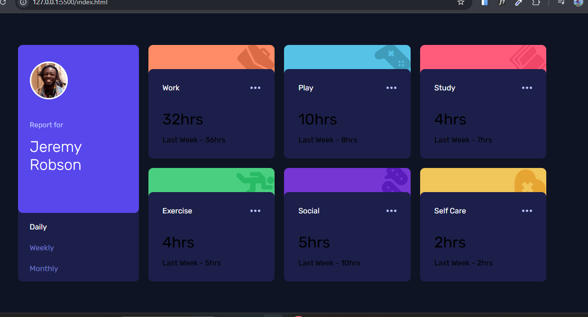

# Frontend Mentor - Time tracking dashboard solution

This is a solution to the [Time tracking dashboard challenge on Frontend Mentor](https://www.frontendmentor.io/challenges/time-tracking-dashboard-UIQ7167Jw). Frontend Mentor challenges help you improve your coding skills by building realistic projects. 

## Table of contents

- [Overview](#overview)
  - [The challenge](#the-challenge)
  - [Screenshot](#screenshot)
  - [Links](#links)
- [My process](#my-process)
  - [Built with](#built-with)
  - [What I learned](#what-i-learned)
  - [Continued development](#continued-development)
  - [Useful resources](#useful-resources)
- [Author](#author)
- [Acknowledgments](#acknowledgments)

## Overview

### The challenge

Users should be able to:

- View the optimal layout for the site depending on their device's screen size
- See hover states for all interactive elements on the page
- Switch between viewing Daily, Weekly, and Monthly stats

### Screenshot

### Links

- Solution URL: [Add solution URL here](https://your-solution-url.com)
- Live Site URL: [Vercel Live Link - to be added](#)

## My process

### Built with

- Semantic HTML5 markup
- CSS custom properties
- Flexbox
- CSS Grid

### What I learned

During this project, I improved my skills in building responsive layouts using CSS Grid and Flexbox. I also practiced structuring semantic HTML and managing styles with CSS custom properties for maintainability.

### Continued development

I plan to further enhance my JavaScript skills to add interactivity to this dashboard, such as dynamically switching between daily, weekly, and monthly views.

### Useful resources

- [Frontend Mentor](https://www.frontendmentor.io/) - For realistic project challenges.
- [CSS Tricks](https://css-tricks.com/) - Helpful articles on CSS techniques.

## Author

- Brian Mwangi
- Frontend Mentor - [Brian Mwangi](https://www.frontendmentor.io/profile/yourusername)

## Acknowledgments

Thanks to the Frontend Mentor community for inspiration and support during this project.
